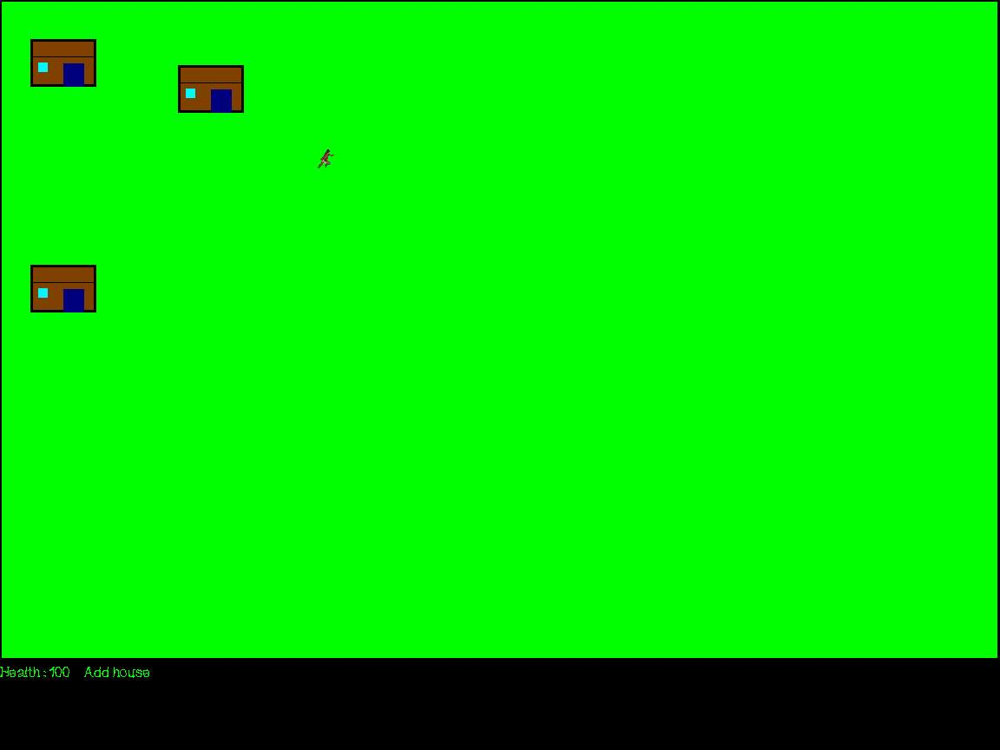



## Easy game example

### Description

This code shows how to use collision detection by pixel and some (very little) bitblt.

Fully editable and easy to understand, could make a really fun game like a SAG (Soft Air Gun) game.

Plz vote and give feedback, and i hope you like it!
 
### More Info
 

             |
---                |---
**Submitted On**   |2001-06-03 20:26:16
**By**             |[ReXz](https://github.com/Planet-Source-Code/PSCIndex/blob/master/ByAuthor/rexz.md)
**Level**          |Beginner
**User Rating**    |4.7 (28 globes from 6 users)
**Compatibility**  |VB 6\.0
**Category**       |[Games](https://github.com/Planet-Source-Code/PSCIndex/blob/master/ByCategory/games__1-38.md)
**World**          |[Visual Basic](https://github.com/Planet-Source-Code/PSCIndex/blob/master/ByWorld/visual-basic.md)
**Archive File**   |[Easy game 20506632001\.zip](https://github.com/Planet-Source-Code/rexz-easy-game-example__1-23738/archive/master.zip)

### API Declarations

In code

